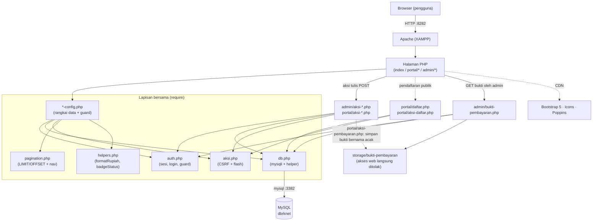
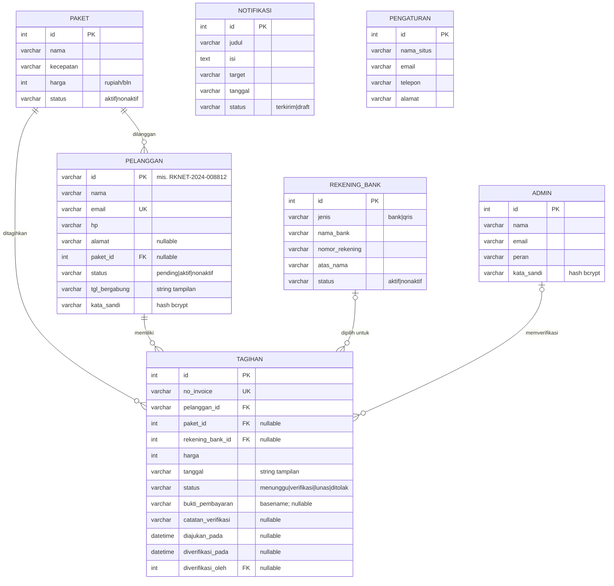
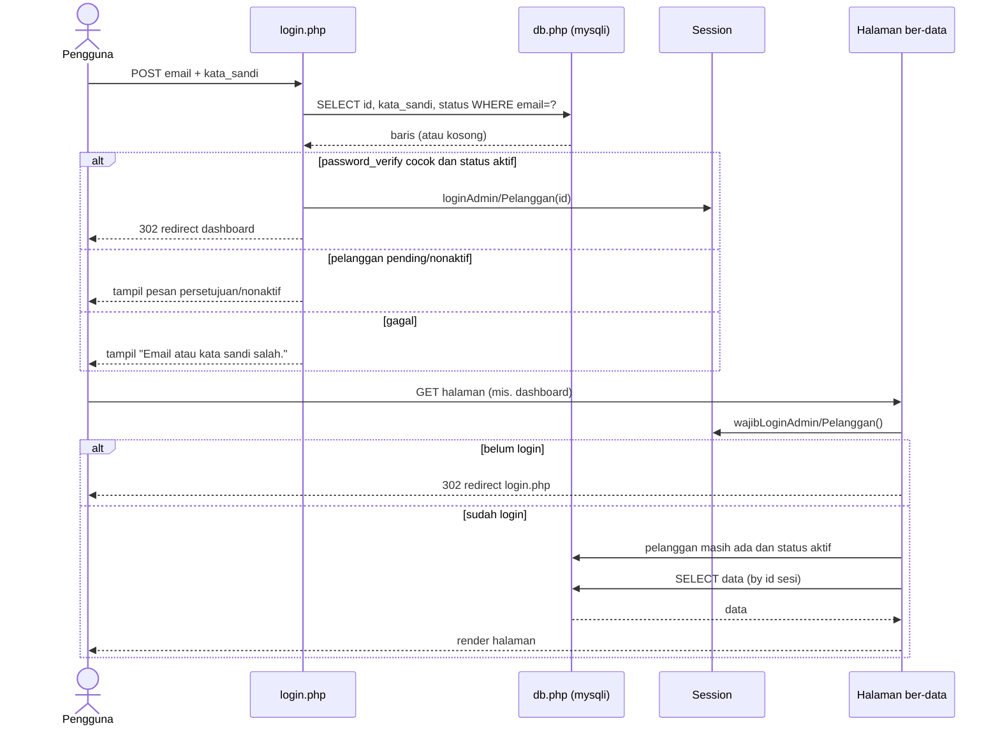
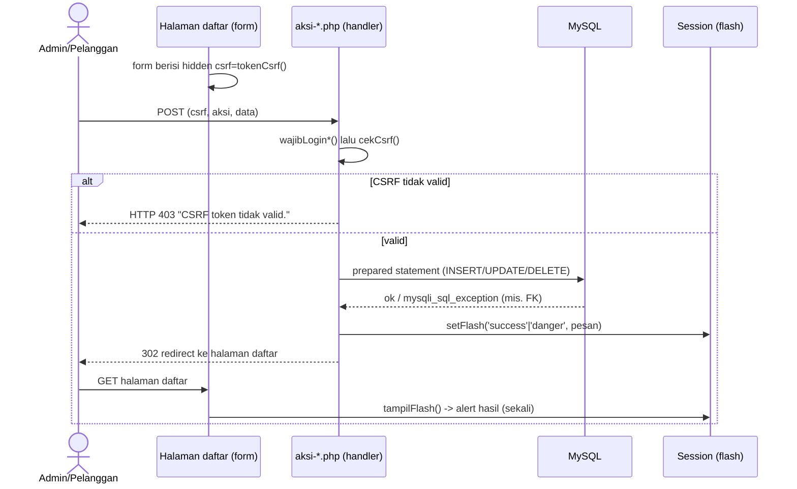
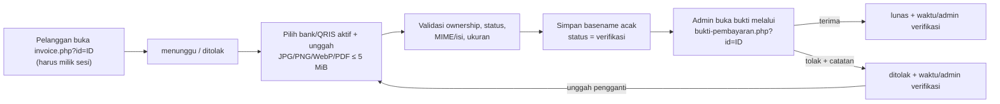
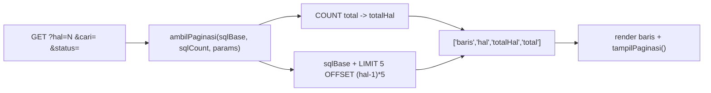
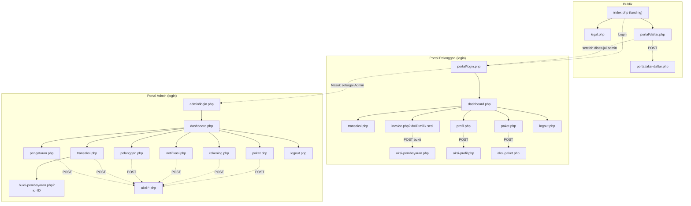

# Dokumentasi Teknis — RKnet Indonesia

Dokumentasi arsitektur, basis data (ERD), dan alur (flow) aplikasi web RKnet Indonesia.
Diagram memakai **Mermaid** (terender otomatis di GitHub/VS Code).

- **Stack:** PHP native (tanpa framework/Composer) · MySQL/MariaDB · Bootstrap 5.3 (CDN).
- **Server:** XAMPP — Apache **port 8282**, MySQL **port 3382**, database **`dbrknet`**.
- **Konvensi:** nama domain & komentar Bahasa Indonesia; output dinamis di-`htmlspecialchars()`.

---

## 1. Ringkasan Sistem

Tiga area dalam satu aplikasi, berbagi gaya visual "Modern Biru":

| Area | Akses | Otentikasi | Sumber data |
|------|-------|-----------|-------------|
| **Landing & legal** (`index.php`, `legal.php`) | Publik | — | `config.php` (statis) |
| **Portal Pelanggan** (`portal/`) | Pendaftaran publik + login pelanggan aktif | Session | DB `dbrknet` (read) + aksi tulis |
| **Portal Admin** (`admin/`) | Login admin | Session | DB `dbrknet` (read) + aksi tulis (CRUD) |

Data terkelola dibaca dari DB di config/halaman, lalu aksi tulis (CRUD, auth, profil, pembayaran) lewat handler ber-CSRF dengan pola **Post-Redirect-Get**. Konten marketing landing tetap statis di `config.php`.

---

## 2. Arsitektur Komponen



**Pola penyusunan halaman** (portal & admin):

```php
require __DIR__ . '/../admin-config.php';   // guard + data + helper
$judulHalaman = '...'; $menuAktif = '...';
include 'partials/shell-head.php';   // <head>
include 'partials/shell-open.php';   // body, sidebar, topbar, flash
//   ... konten ...
include 'partials/shell-close.php';  // tutup layout + skrip
```

---

## 3. Struktur Direktori

```
rknet/
├── index.php                 # landing (rangkai partials/)
├── legal.php                  # syarat/privasi/refund
├── config.php                 # konten landing (statis)
│
├── db.php                     # koneksi mysqli + helper (kueri/kueriSatu/kueriNilai/eksekusi); konstanta DB_*
├── auth.php                   # sesi, login/logout, guard
├── aksi.php                   # CSRF (tokenCsrf/cekCsrf) + flash (setFlash/tampilFlash)
├── pagination.php             # halamanSaatIni/ambilPaginasi/tampilPaginasi
├── helpers.php                # formatRupiah(), badgeStatus()
├── admin-config.php           # data admin (SELECT) + guard admin
├── portal-config.php          # data pelanggan login (SELECT) + guard pelanggan
│
├── database/
│   ├── schema.sql             # 7 tabel saat ini (setup baru)
│   ├── seed.sql               # data awal, termasuk BCA/Mandiri/BRI/QRIS
│   ├── migrasi-pembayaran-bank.sql  # migrasi aditif satu kali untuk DB lama
│   ├── migrasi-qris.sql       # satu kali jika migrasi pembayaran sudah pernah dijalankan
│   └── migrasi-pendaftaran-pelanggan.sql # email unik + default status pending untuk DB lama
│
├── admin/
│   ├── login.php  logout.php
│   ├── dashboard.php  pelanggan.php  paket.php  transaksi.php
│   ├── rekening.php  notifikasi.php  pengaturan.php
│   ├── bukti-pembayaran.php   # sajikan bukti hanya ke admin login
│   ├── aksi-paket.php  aksi-rekening.php  aksi-notifikasi.php
│   ├── aksi-pelanggan.php  aksi-transaksi.php  aksi-pengaturan.php
│   └── partials/  (shell-head, sidebar, topbar, shell-open, shell-close)
│
├── portal/
│   ├── daftar.php  login.php  logout.php
│   ├── dashboard.php  transaksi.php  invoice.php  paket.php  profil.php
│   ├── aksi-daftar.php  aksi-profil.php  aksi-paket.php  aksi-pembayaran.php
│   └── partials/  (shell-head, sidebar, topbar, shell-open, shell-close, notif)
│
├── partials/                  # section landing (navbar, hero, package, dst.)
├── assets/                    # css/ (style, portal) · js/ · img/ (termasuk qris.jpeg)
├── storage/bukti-pembayaran/  # bukti; .htaccess blokir web, isi diabaikan Git
└── docs/superpowers/          # spec & plan tiap fitur
```

---

## 4. ERD (Entity Relationship Diagram)



**Relasi (foreign key):**
- `pelanggan.paket_id → paket.id` (paket aktif pelanggan; nullable).
- `tagihan.pelanggan_id → pelanggan.id` (pemilik tagihan).
- `tagihan.paket_id → paket.id` (paket yang ditagih; nullable).
- `tagihan.rekening_bank_id → rekening_bank.id` (metode pembayaran bank/QRIS yang dipilih; nullable).
- `tagihan.diverifikasi_oleh → admin.id` (admin penerima/penolak bukti; nullable).
- `notifikasi` dan `pengaturan` berdiri sendiri (tanpa FK).

**Catatan desain:** `pelanggan.email` memiliki constraint unik `uq_pelanggan_email` dan status default `pending`. `rekening_bank.jenis` dibatasi aplikasi ke `bank|qris`; baris QRIS dinormalisasi dengan `nama_bank='QRIS'` dan `nomor_rekening='QRIS'`. Tanggal tagihan/bergabung tetap `VARCHAR` berisi string tampilan Indonesia (mis. "15 Jun 2026"); waktu pengajuan dan verifikasi pembayaran memakai `DATETIME`. `bukti_pembayaran` hanya menyimpan basename acak, bukan path dari klien.

---

## 5. Skema Tabel (ringkas)

| Tabel | PK | Kolom utama | Status valid |
|-------|----|-------------|--------------|
| `admin` | `id` (AI) | nama, email, peran, kata_sandi | — |
| `rekening_bank` | `id` (AI) | jenis (`bank`/`qris`), nama_bank, nomor_rekening, atas_nama, status | aktif, nonaktif |
| `paket` | `id` (AI) | nama, kecepatan, harga, status | aktif, nonaktif |
| `pelanggan` | `id` (varchar) | nama, email unik, hp, alamat, **paket_id→paket**, status (default `pending`), tgl_bergabung, kata_sandi | pending, aktif, nonaktif |
| `tagihan` | `id` (AI) | no_invoice unik, **pelanggan_id→pelanggan**, **paket_id→paket**, **rekening_bank_id→rekening_bank**, harga, tanggal, bukti basename, catatan/waktu/admin verifikasi | menunggu, verifikasi, lunas, ditolak |
| `notifikasi` | `id` (AI) | judul, isi, target, tanggal, status | terkirim, draft |
| `pengaturan` | `id` (AI) | nama_situs, email, telepon, alamat | — (1 baris) |

Setup baru: `mysql -h 127.0.0.1 -P 3382 -u root < database/schema.sql` lalu `< database/seed.sql`. Seed menyertakan pilihan aktif BCA, Mandiri, BRI, dan QRIS serta menetapkan status pelanggan seed secara eksplisit. Untuk database enam tabel yang belum memiliki alur pembayaran, jalankan `database/migrasi-pembayaran-bank.sql` **sekali** sebagai migrasi aditif; jangan jalankan ulang schema/seed. Database yang sudah menjalankan migrasi pembayaran versi sebelumnya harus menjalankan `database/migrasi-qris.sql` **sekali**. Database lama juga harus menjalankan preflight duplikat email pada komentar `database/migrasi-pendaftaran-pelanggan.sql`, lalu menjalankan migrasi tersebut **sekali** untuk menambah email unik dan default status `pending`.

**Perbarui seed dari data terkini:** jalankan `powershell -File database/dump-seed.ps1` untuk meregenerasi `database/seed.sql` (data-only) dari isi DB saat ini — berguna sebelum memindahkan proyek ke komputer lain agar datanya identik.

---

## 6. Alur Otentikasi (login + guard)



- Sesi **admin & pelanggan terpisah** (`$_SESSION['admin_id']` int, `$_SESSION['pelanggan_id']` string) dan ID sesi diregenerasi setelah login berhasil.
- Guard dipasang lewat **rantai config** (`admin-config.php`/`portal-config.php` memanggil `wajibLogin*()`), lalu guard pelanggan memvalidasi ulang keberadaan dan status `aktif` pada setiap request. Halaman daftar/login standalone tetap publik.
- Logout (`logout.php`) menghapus key sesi area itu lalu redirect ke login.

**Alur pendaftaran:** `portal/daftar.php` hanya menampilkan paket aktif dan mengirim POST+CSRF ke `portal/aksi-daftar.php`. Handler memvalidasi semua field, memeriksa ulang paket aktif, membuat hash password, lalu di bawah advisory lock `rknet_id_pelanggan` menghasilkan ID `RKNET-YYYY-NNNNNN` dari suffix valid tertinggi global. Pelanggan disimpan dengan status `pending`; pendaftaran **tidak membuat tagihan**. Admin kemudian memilih transisi eksplisit `pending→aktif` (setujui) atau `pending→nonaktif` (tolak).

---

## 7. Alur Aksi Tulis (CRUD) — Post-Redirect-Get



**Pola dasar handler:** `wajibLogin*()` → `cekCsrf()` → validasi → prepared statement → `setFlash()` → redirect.

| Handler | Operasi |
|---------|---------|
| `admin/aksi-paket.php` | tambah · edit · hapus (FK terpakai → flash gagal) |
| `admin/aksi-rekening.php` | CRUD tujuan bank/QRIS; metode yang pernah dipakai dinonaktifkan |
| `admin/aksi-notifikasi.php` | tambah · hapus |
| `admin/aksi-pelanggan.php` | edit · status eksplisit (`pending→aktif/nonaktif`, `aktif→nonaktif`, `nonaktif→aktif`) dengan expected-status kondisional |
| `admin/aksi-transaksi.php` | terima/tolak bukti berstatus `verifikasi`; penolakan wajib punya catatan |
| `admin/aksi-pengaturan.php` | profil admin · ubah password · info situs |
| `portal/aksi-profil.php` | edit info akun · ganti password |
| `portal/aksi-paket.php` | ubah paket aktif (UPDATE `pelanggan.paket_id`) |
| `portal/aksi-pembayaran.php` | pilih metode bank/QRIS aktif · validasi/unggah bukti · ajukan verifikasi |
| `portal/aksi-daftar.php` | buat akun publik berstatus `pending` tanpa membuat invoice/tagihan |

**Alur pembayaran bank/QRIS:**



Invoice dituju dengan `?id=<tagihan>` dan selalu dibatasi oleh `pelanggan_id` dari sesi. Pilihan QRIS menampilkan `assets/img/qris.jpeg`; bank tetap menampilkan nama dan nomor rekening. Status hanya bergerak `menunggu → verifikasi → lunas|ditolak`; bukti yang ditolak dapat diganti dan diajukan ulang.

---

## 8. Alur Data Read & Pagination

**Read (config → array):** tiap `*-config.php` menjalankan `SELECT` lalu memetakan hasil ke array dengan **alias kolom** = key yang dipakai partial (mis. `no_invoice AS noInvoice`), sehingga markup tak berubah saat sumber data pindah dari dummy ke DB.

**Pagination sisi-server** (tabel daftar besar):



- Page size `PER_HALAMAN = 5`. `?hal` di-clamp ke `1..totalHal`.
- Cari/filter **sisi-server via GET**: `?cari=` (LIKE) & `?status=` (kesetaraan) terikat sebagai bound params. Nilai dipertahankan di nav halaman & form.
- Dipaginasi: admin **pelanggan, transaksi, notifikasi** + portal **riwayat transaksi**. Kartu paket & dashboard tidak.

---

## 9. Keamanan

- **Otentikasi:** `password_verify()` terhadap hash bcrypt (`password_hash`) di DB. Ganti password mem-verifikasi password lama.
- **Proteksi halaman:** guard `wajibLogin*()` via rantai config; pelanggan harus tetap ada dan berstatus `aktif`, jika tidak sesi dibersihkan dan diarahkan ke login.
- **Pendaftaran:** email pelanggan unik; ID pelanggan dibuat di dalam MySQL advisory lock; akun baru berstatus `pending` sampai transisi persetujuan admin berhasil.
- **CSRF:** setiap form tulis menyertakan token sesi (`tokenCsrf()`), diverifikasi `cekCsrf()` dengan `hash_equals`; gagal → HTTP 403.
- **SQL Injection:** semua query parameter pakai **prepared statement** (mysqli, via helper `kueri`/`kueriSatu`/`kueriNilai`/`eksekusi` dengan `bind_param` otomatis); `LIMIT/OFFSET` di-cast integer.
- **XSS:** output dinamis di-`htmlspecialchars()`.
- **PRG:** redirect setelah POST mencegah submit ganda; feedback via flash sekali tampil.
- **Kepemilikan pembayaran:** invoice dan handler unggah mencocokkan ID tagihan dengan `idPelangganSaatIni()`; hanya metode bank/QRIS aktif dan status `menunggu`/`ditolak` yang menerima unggahan.
- **Validasi unggahan:** batas 5 MiB; MIME dideteksi sisi server dengan `finfo`, gambar diperiksa dengan `getimagesize`, dan nama penyimpanan dibuat acak. Format yang diterima hanya JPG, PNG, WebP, dan PDF.
- **Penyimpanan bukti:** file berada di `storage/bukti-pembayaran/`, akses web langsung ditolak `.htaccess`, dan isi unggahan diabaikan Git. `admin/bukti-pembayaran.php` mewajibkan sesi admin, memvalidasi basename, dan mengirim header `no-store`/`nosniff`.
- **Verifikasi admin:** terima/tolak hanya dapat mengubah tagihan berstatus `verifikasi`; penerimaan juga mensyaratkan rekening dan bukti, sedangkan penolakan wajib menyimpan alasan.
- **Error DB:** `db.php` menangkap kegagalan koneksi & query (tabel belum ada) → kartu pesan rapi tanpa membocorkan stack trace.

---

## 10. Peta Halaman (Sitemap)



---

## 11. Menjalankan & Kredensial Demo

1. Jalankan **Apache (8282)** & **MySQL (3382)** dari XAMPP.
2. Setup baru: import `database/schema.sql` lalu `database/seed.sql` ke `dbrknet` (host 127.0.0.1, port 3382, user `root`, tanpa password).
3. DB enam tabel yang belum memiliki alur pembayaran: jalankan `database/migrasi-pembayaran-bank.sql` satu kali, bukan schema/seed.
4. DB yang sudah menjalankan migrasi pembayaran versi sebelumnya: jalankan `database/migrasi-qris.sql` satu kali.
5. DB lama: preflight duplikat email lalu jalankan `database/migrasi-pendaftaran-pelanggan.sql` satu kali.
6. Pastikan Apache memiliki izin tulis ke `storage/bukti-pembayaran/`.
7. Buka `http://localhost:8282/rknet/`.

| Peran | Email | Password |
|-------|-------|----------|
| Admin | `admin@rknet.id` | `admin123` |
| Pelanggan | `dwi.anjasmoro@gmail.com` | `pelanggan123` |

> Semua pelanggan seed memakai password `pelanggan123`.

**Lint PHP:** `/d/WebServer/xampp82/php/php.exe -l <file>` (binari XAMPP, bukan di PATH).

---

## 12. Status Modul

- Landing/legal: konten publik statis.
- Portal pelanggan: pendaftaran publik dengan persetujuan admin, auth pelanggan aktif, dashboard, transaksi, invoice milik sesi, pembayaran bank/QRIS, paket aktif, dan profil.
- Portal admin: auth, dashboard, pelanggan dengan transisi persetujuan eksplisit, paket, verifikasi pembayaran, rekening & QRIS, notifikasi, dan pengaturan.
- Data: 7 tabel aktif, aksi tulis ber-CSRF/PRG, serta pagination sisi server pada daftar utama.
