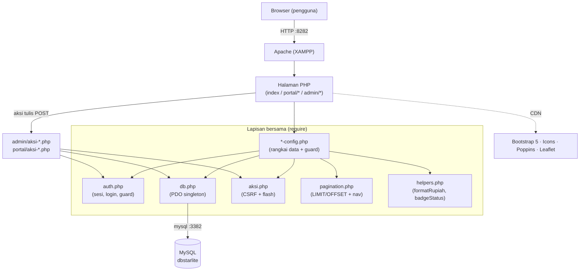
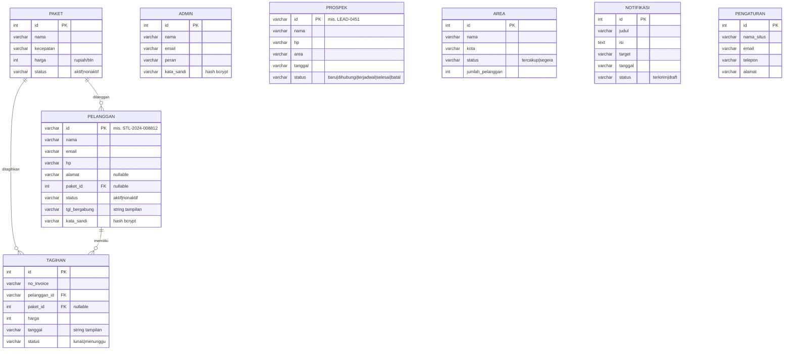
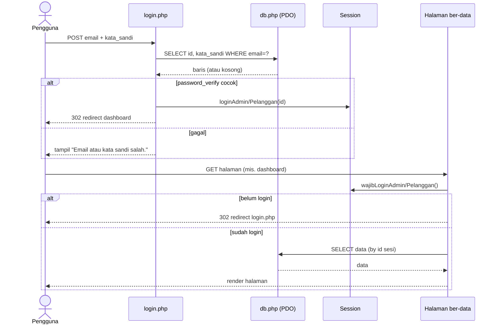
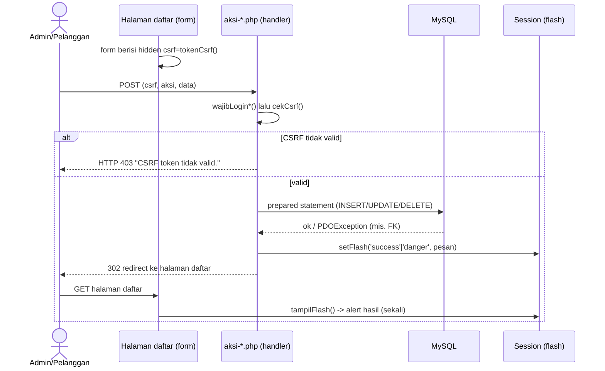
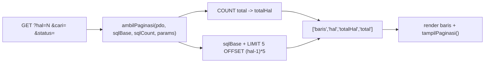
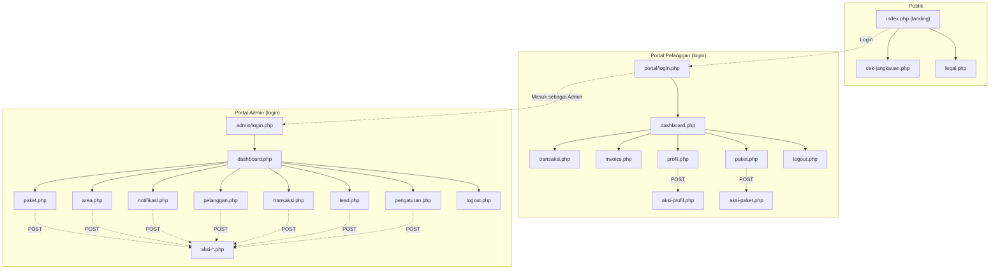

# Dokumentasi Teknis — Starlite Indonesia

Dokumentasi arsitektur, basis data (ERD), dan alur (flow) aplikasi web Starlite Indonesia.
Diagram memakai **Mermaid** (terender otomatis di GitHub/VS Code).

- **Stack:** PHP native (tanpa framework/Composer) · MySQL/MariaDB · Bootstrap 5.3 (CDN) · Leaflet (cek jangkauan).
- **Server:** XAMPP — Apache **port 8282**, MySQL **port 3382**, database **`dbstarlite`**.
- **Konvensi:** nama domain & komentar Bahasa Indonesia; output dinamis di-`htmlspecialchars()`.

---

## 1. Ringkasan Sistem

Tiga area dalam satu aplikasi, berbagi gaya visual "Modern Biru":

| Area | Akses | Otentikasi | Sumber data |
|------|-------|-----------|-------------|
| **Landing** (`index.php`, `cek-jangkauan.php`, `legal.php`) | Publik | — | `config.php`, `cek-jangkauan-config.php` (statis) |
| **Portal Pelanggan** (`portal/`) | Login pelanggan | Session | DB `dbstarlite` (read) + aksi tulis |
| **Portal Admin** (`admin/`) | Login admin | Session | DB `dbstarlite` (read) + aksi tulis (CRUD) |

Data terkelola dibaca **read-only** dari DB di config, lalu aksi tulis (CRUD, auth, profil) lewat handler ber-CSRF dengan pola **Post-Redirect-Get**. Konten marketing landing tetap statis di `config.php`.

---

## 2. Arsitektur Komponen



**Pola penyusunan halaman** (portal & admin):

```php
require __DIR__ . '/../admin-config.php';   // guard + data + helper
$judulHalaman = '...'; $menuAktif = '...';
include 'partials/shell-head.php';   // <head>
include 'partials/shell-open.php';   // body, sidebar, topbar, flash
//   ... konten ...
include 'partials/shell-close.php';  // tutup layout + skrip
```

---

## 3. Struktur Direktori

```
starlite/
├── index.php                 # landing (rangkai partials/)
├── cek-jangkauan.php          # cek jangkauan (Leaflet + Nominatim + emsifa)
├── legal.php                  # syarat/privasi/refund
├── config.php                 # konten landing (statis)
├── cek-jangkauan-config.php   # data area tercakup (statis)
│
├── db.php                     # koneksi PDO -> dbstarlite
├── auth.php                   # sesi, login/logout, guard
├── aksi.php                   # CSRF (tokenCsrf/cekCsrf) + flash (setFlash/tampilFlash)
├── pagination.php             # halamanSaatIni/ambilPaginasi/tampilPaginasi
├── helpers.php                # formatRupiah(), badgeStatus()
├── admin-config.php           # data admin (SELECT) + guard admin
├── portal-config.php          # data pelanggan login (SELECT) + guard pelanggan
│
├── database/
│   ├── schema.sql             # 8 tabel (struktur Bahasa Indonesia)
│   └── seed.sql               # data awal
│
├── admin/
│   ├── login.php  logout.php
│   ├── dashboard.php  pelanggan.php  paket.php  transaksi.php
│   ├── lead.php  area.php  notifikasi.php  pengaturan.php
│   ├── aksi-paket.php  aksi-area.php  aksi-notifikasi.php  aksi-pelanggan.php
│   ├── aksi-transaksi.php  aksi-lead.php  aksi-pengaturan.php
│   └── partials/  (shell-head, sidebar, topbar, shell-open, shell-close)
│
├── portal/
│   ├── login.php  logout.php
│   ├── dashboard.php  transaksi.php  invoice.php  paket.php  profil.php
│   ├── aksi-profil.php  aksi-paket.php
│   └── partials/  (shell-head, sidebar, topbar, shell-open, shell-close, notif)
│
├── partials/                  # section landing (navbar, hero, package, dst.)
├── assets/                    # css/ (style, portal) · js/ · img/
└── docs/superpowers/          # spec & plan tiap fitur
```

---

## 4. ERD (Entity Relationship Diagram)



**Relasi (foreign key):**
- `pelanggan.paket_id → paket.id` (paket aktif pelanggan; nullable).
- `tagihan.pelanggan_id → pelanggan.id` (pemilik tagihan).
- `tagihan.paket_id → paket.id` (paket yang ditagih; nullable).
- `prospek`, `area`, `notifikasi`, `pengaturan`, `admin` berdiri sendiri (tanpa FK).

**Catatan desain:** kolom tanggal disimpan `VARCHAR` berisi string tampilan Indonesia ("15 Jun 2026") agar output identik tanpa pemformatan — keputusan sadar untuk aplikasi UI (bisa dimigrasi ke `DATE`). Tabel lead dinamai **`prospek`** untuk menghindari kata kunci ter-reservasi `LEAD` di MySQL 8.

---

## 5. Skema Tabel (ringkas)

| Tabel | PK | Kolom utama | Status valid |
|-------|----|-------------|--------------|
| `admin` | `id` (AI) | nama, email, peran, kata_sandi | — |
| `paket` | `id` (AI) | nama, kecepatan, harga, status | aktif, nonaktif |
| `pelanggan` | `id` (varchar) | nama, email, hp, alamat, **paket_id→paket**, status, tgl_bergabung, kata_sandi | aktif, nonaktif |
| `tagihan` | `id` (AI) | no_invoice, **pelanggan_id→pelanggan**, **paket_id→paket**, harga, tanggal, status | lunas, menunggu |
| `prospek` | `id` (varchar) | nama, hp, area, tanggal, status | baru, dihubungi, terjadwal, selesai, batal |
| `area` | `id` (AI) | nama, kota, status, jumlah_pelanggan | tercakup, segera |
| `notifikasi` | `id` (AI) | judul, isi, target, tanggal, status | terkirim, draft |
| `pengaturan` | `id` (AI) | nama_situs, email, telepon, alamat | — (1 baris) |

Setup: `mysql -h 127.0.0.1 -P 3382 -u root < database/schema.sql` lalu `< database/seed.sql`.

**Perbarui seed dari data terkini:** jalankan `powershell -File database/dump-seed.ps1` untuk meregenerasi `database/seed.sql` (data-only) dari isi DB saat ini — berguna sebelum memindahkan proyek ke komputer lain agar datanya identik.

---

## 6. Alur Otentikasi (login + guard)



- Sesi **admin & pelanggan terpisah** (`$_SESSION['admin_id']` int, `$_SESSION['pelanggan_id']` string) → bisa login dua area sekaligus.
- Guard dipasang lewat **rantai config** (`admin-config.php`/`portal-config.php` memanggil `wajibLogin*()`), jadi setiap halaman ber-data otomatis terproteksi; halaman login standalone (tak memuat config) tetap bisa diakses.
- Logout (`logout.php`) menghapus key sesi area itu lalu redirect ke login.

---

## 7. Alur Aksi Tulis (CRUD) — Post-Redirect-Get



**Handler aksi (semua pola sama):** `wajibLogin*()` → `cekCsrf()` → prepared statement → `setFlash()` → redirect.

| Handler | Operasi |
|---------|---------|
| `admin/aksi-paket.php` | tambah · edit · hapus (FK terpakai → flash gagal) |
| `admin/aksi-area.php` | tambah · edit · hapus |
| `admin/aksi-notifikasi.php` | tambah · hapus |
| `admin/aksi-pelanggan.php` | edit · toggle status (aktif↔nonaktif) |
| `admin/aksi-transaksi.php` | tandai lunas |
| `admin/aksi-lead.php` | tandai dihubungi |
| `admin/aksi-pengaturan.php` | profil admin · ubah password · info situs |
| `portal/aksi-profil.php` | edit info akun · ganti password |
| `portal/aksi-paket.php` | ubah paket aktif (UPDATE `pelanggan.paket_id`) |

---

## 8. Alur Data Read & Pagination

**Read (config → array):** tiap `*-config.php` menjalankan `SELECT` lalu memetakan hasil ke array dengan **alias kolom** = key yang dipakai partial (mis. `no_invoice AS noInvoice`, `jumlah_pelanggan AS jumlahPelanggan`), sehingga markup tak berubah saat sumber data pindah dari dummy ke DB.

**Pagination sisi-server** (tabel daftar besar):



- Page size `PER_HALAMAN = 5`. `?hal` di-clamp ke `1..totalHal`.
- Cari/filter **sisi-server via GET**: `?cari=` (LIKE) & `?status=` (kesetaraan) terikat sebagai bound params. Nilai dipertahankan di nav halaman & form.
- Dipaginasi: admin **pelanggan, transaksi, lead, notifikasi** + portal **riwayat transaksi**. Kartu (paket/area) & dashboard tidak.

---

## 9. Keamanan

- **Otentikasi:** `password_verify()` terhadap hash bcrypt (`password_hash`) di DB. Ganti password mem-verifikasi password lama.
- **Proteksi halaman:** guard `wajibLogin*()` via rantai config; tanpa sesi → redirect login.
- **CSRF:** setiap form tulis menyertakan token sesi (`tokenCsrf()`), diverifikasi `cekCsrf()` dengan `hash_equals`; gagal → HTTP 403.
- **SQL Injection:** semua query parameter pakai **prepared statement** (PDO); `LIMIT/OFFSET` di-cast integer.
- **XSS:** output dinamis di-`htmlspecialchars()`.
- **PRG:** redirect setelah POST mencegah submit ganda; feedback via flash sekali tampil.
- **Error DB:** `db.php` menangkap kegagalan koneksi & query (tabel belum ada) → kartu pesan rapi tanpa membocorkan stack trace.

---

## 10. Peta Halaman (Sitemap)



---

## 11. Menjalankan & Kredensial Demo

1. Jalankan **Apache (8282)** & **MySQL (3382)** dari XAMPP.
2. Import DB: `database/schema.sql` lalu `database/seed.sql` ke `dbstarlite` (host 127.0.0.1, port 3382, user `root`, tanpa password).
3. Buka `http://localhost:8282/starlite/`.

| Peran | Email | Password |
|-------|-------|----------|
| Admin | `admin@starlite.id` | `admin123` |
| Pelanggan | `dwi.anjasmoro@gmail.com` | `pelanggan123` |

> Semua pelanggan seed memakai password `pelanggan123`.

**Lint PHP:** `/d/WebServer/xampp82/php/php.exe -l <file>` (binari XAMPP, bukan di PATH).

---

## 12. Riwayat Pembangunan

Spec & rencana tiap fitur ada di `docs/superpowers/`:
1. Landing → 2. Portal pelanggan → 3. Portal admin (inti) → 4. Admin tahap berikutnya (Lead/Area/Notifikasi/Pengaturan) → 5. Integrasi DB Fase 1 (read-only) → 6. Fase 2: Auth → Admin CRUD → Portal write → 7. Pagination sisi-server.

Seluruh alur telah diuji end-to-end (navigasi, guard, login/logout, CRUD, CSRF, pagination) dengan hasil lulus penuh.
